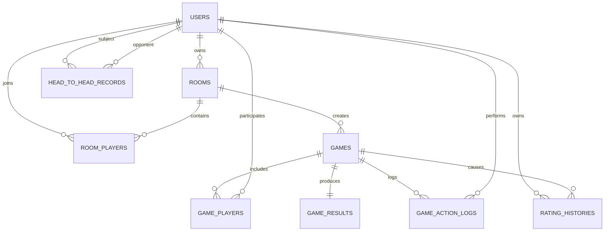

# 실시간 타일 보드게임 ERD 및 테이블 상세 명세 v1

작성 기준: 2026-07-14  
문서 상태: 1차 MVP + 후속 확장 고려 설계안  
대상 DB: MySQL 8.x  
ORM: JPA/Hibernate

연결 문서:

- `Realtime_Tile_Game_Project_Planning_v1.md`
- `Realtime_Tile_Game_Rules_Spec_v1.md`
- `Realtime_Tile_Game_UI_Flow_Wireframe_v1.md`
- `Realtime_Tile_Game_SRS_v1.md`
- `Realtime_Tile_Game_Modes_Rating_Record_Spec_v1.md`

---

# 1. 설계 원칙

## 1-1. 실시간 상태와 영속 데이터 분리

DB에는 장기 보존이 필요한 데이터를 저장한다.

- 사용자
- 방 메타데이터
- 참가 이력
- 게임 시작·종료 결과
- 참가자별 결과
- 랭킹 변동
- 상대 전적
- 주요 행동 로그

실시간으로 자주 바뀌는 다음 상태는 1차에서 서버 메모리에 둔다.

- 공용 타일 풀
- 플레이어별 손패
- 공개 테이블
- 현재 턴
- TurnDraft
- TurnSnapshot
- 조커 현재 역할
- 타일 위치
- 남은 턴 시간

## 1-2. 서버 재시작 복원

서버 재시작 후 진행 중 게임 완전 복원은 1차 필수 범위가 아니다.

단, 후속 확장을 위해 `game_state_snapshots` 테이블을 선택적으로 추가할 수 있게 구조를 열어둔다.

## 1-3. 중복 처리 방지

랭킹, 상대 전적, 게임 종료는 동일 게임에 대해 한 번만 반영되어야 한다.

핵심 장치:

```text
games.rating_applied
game_action_logs.action_id UNIQUE
game_results.game_id UNIQUE
```

---

# 2. 전체 ERD



---

# 3. ENUM 정의

## UserStatus

```text
ACTIVE
BLOCKED
DELETED
```

## RoomStatus

```text
WAITING
PLAYING
FINISHED
CLOSED
```

## ReadyStatus

```text
NOT_READY
READY
```

## GameStatus

```text
PREPARING
IN_PROGRESS
FINISHED
ABORTED
```

## GameMode

```text
CLASSIC
SPEED
```

## ResultType

```text
WIN
LOSS
DRAW
```

## GameEndReason

```text
RACK_EMPTY
DEADLOCK
SPEED_TIME_EXPIRED
ABORTED
```

## ConnectionStatus

```text
CONNECTED
DISCONNECTED
```

## ActionResult

```text
SUCCESS
REJECTED
FAILED
```

---

# 4. users

## 목적

회원 인증, 프로필, 현재 랭킹 점수를 저장한다.

## 컬럼

| 컬럼 | 타입 | NULL | 기본값 | 설명 |
|---|---|---:|---|---|
| id | BIGINT | N | AUTO_INCREMENT | PK |
| email | VARCHAR(255) | N |  | 로그인 이메일 |
| password | VARCHAR(255) | N |  | 암호화 비밀번호 |
| nickname | VARCHAR(30) | N |  | 표시 닉네임 |
| avatar_type | VARCHAR(50) | N | DEFAULT_01 | 기본 아바타 |
| rating_score | INT | N | 1000 | CLASSIC 랭킹 |
| status | VARCHAR(20) | N | ACTIVE | 사용자 상태 |
| created_at | DATETIME(6) | N | CURRENT_TIMESTAMP | 생성일 |
| updated_at | DATETIME(6) | N | CURRENT_TIMESTAMP | 수정일 |
| deleted_at | DATETIME(6) | Y | NULL | 소프트 삭제일 |

## 제약

```text
PK users(id)
UK users(email)
UK users(nickname)
CHECK rating_score >= 0
```

## 인덱스

```text
idx_users_rating_score(rating_score DESC)
idx_users_status(status)
```

---

# 5. rooms

## 목적

대기방과 게임방 설정을 저장한다.

## 컬럼

| 컬럼 | 타입 | NULL | 기본값 | 설명 |
|---|---|---:|---|---|
| id | BIGINT | N | AUTO_INCREMENT | PK |
| room_name | VARCHAR(50) | N |  | 방 이름 |
| owner_user_id | BIGINT | N |  | 현재 방장 |
| max_players | TINYINT | N | 4 | 2~4 |
| game_mode | VARCHAR(20) | N | CLASSIC | 게임 모드 |
| turn_time_limit_seconds | INT | N | 120 | 턴 제한 |
| game_time_limit_seconds | INT | Y | NULL | SPEED 전체 제한 |
| is_public | BOOLEAN | N | TRUE | 공개방 여부 |
| status | VARCHAR(20) | N | WAITING | 방 상태 |
| created_at | DATETIME(6) | N | CURRENT_TIMESTAMP | 생성일 |
| updated_at | DATETIME(6) | N | CURRENT_TIMESTAMP | 수정일 |
| closed_at | DATETIME(6) | Y | NULL | 종료일 |

## 제약

```text
FK rooms.owner_user_id -> users.id
CHECK max_players BETWEEN 2 AND 4
CHECK turn_time_limit_seconds > 0
```

## 모드 기본값

```text
CLASSIC
turn_time_limit_seconds = 120
game_time_limit_seconds = NULL

SPEED
turn_time_limit_seconds = 20
game_time_limit_seconds = 300
```

## 인덱스

```text
idx_rooms_status_created(status, created_at)
idx_rooms_game_mode_status(game_mode, status)
```

---

# 6. room_players

## 목적

방 참가자, 좌석 순서, 준비 상태를 관리한다.

## 컬럼

| 컬럼 | 타입 | NULL | 설명 |
|---|---|---:|---|
| id | BIGINT | N | PK |
| room_id | BIGINT | N | 방 |
| user_id | BIGINT | N | 사용자 |
| seat_order | TINYINT | N | 턴 순서 |
| ready_status | VARCHAR(20) | N | 준비 상태 |
| is_owner | BOOLEAN | N | 방장 여부 |
| joined_at | DATETIME(6) | N | 입장 시각 |
| left_at | DATETIME(6) | Y | 퇴장 시각 |

## 제약

```text
FK room_players.room_id -> rooms.id
FK room_players.user_id -> users.id
UK (room_id, user_id)
UK (room_id, seat_order)
CHECK seat_order BETWEEN 1 AND 4
```

## 주의

퇴장 이력을 남기기 위해 물리 삭제보다 `left_at` 기록을 권장한다.

현재 참가자 조회:

```text
left_at IS NULL
```

---

# 7. games

## 목적

실제 한 판의 공통 정보와 종료 상태를 저장한다.

## 컬럼

| 컬럼 | 타입 | NULL | 기본값 | 설명 |
|---|---|---:|---|---|
| id | BIGINT | N | AUTO_INCREMENT | PK |
| room_id | BIGINT | N |  | 원본 방 |
| game_mode | VARCHAR(20) | N |  | CLASSIC/SPEED |
| status | VARCHAR(20) | N | PREPARING | 게임 상태 |
| starting_user_id | BIGINT | N |  | 선 플레이어 |
| current_state_version | BIGINT | N | 0 | 최종 버전 |
| winner_user_id | BIGINT | Y | NULL | 단독 승자 |
| end_reason | VARCHAR(30) | Y | NULL | 종료 사유 |
| rating_applied | BOOLEAN | N | FALSE | 랭킹 반영 여부 |
| started_at | DATETIME(6) | Y | NULL | 시작 시각 |
| finished_at | DATETIME(6) | Y | NULL | 종료 시각 |
| created_at | DATETIME(6) | N | CURRENT_TIMESTAMP | 생성일 |

## 제약

```text
FK games.room_id -> rooms.id
FK games.starting_user_id -> users.id
FK games.winner_user_id -> users.id
```

## 동점

`DRAW`인 경우:

```text
winner_user_id = NULL
game_results.result_type = DRAW
```

## 인덱스

```text
idx_games_room_id(room_id)
idx_games_status(status)
idx_games_started_at(started_at)
```

---

# 8. game_players

## 목적

게임 참가자별 시작·종료 결과와 랭킹 변동을 저장한다.

## 컬럼

| 컬럼 | 타입 | NULL | 기본값 | 설명 |
|---|---|---:|---|---|
| id | BIGINT | N | AUTO_INCREMENT | PK |
| game_id | BIGINT | N |  | 게임 |
| user_id | BIGINT | N |  | 참가자 |
| seat_order | TINYINT | N |  | 턴 순서 |
| initial_meld_completed | BOOLEAN | N | FALSE | 첫 등록 |
| result_type | VARCHAR(20) | Y | NULL | WIN/LOSS/DRAW |
| remaining_tile_count | INT | Y | NULL | 종료 손패 수 |
| remaining_tile_score | INT | Y | NULL | 종료 손패 점수 |
| contributed_tile_score | INT | N | 0 | SPEED 기여 점수 |
| final_speed_score | INT | Y | NULL | SPEED 최종 점수 |
| rating_before | INT | Y | NULL | 경기 전 |
| rating_delta | INT | Y | NULL | 변동값 |
| rating_after | INT | Y | NULL | 경기 후 |
| connection_status | VARCHAR(20) | N | CONNECTED | 종료 전 연결 |
| joined_at | DATETIME(6) | N |  | 참가 시각 |

## 제약

```text
FK game_players.game_id -> games.id
FK game_players.user_id -> users.id
UK (game_id, user_id)
UK (game_id, seat_order)
```

## 참고

실시간 손패와 테이블은 이 테이블에 저장하지 않는다.

---

# 9. game_results

## 목적

게임 종료 결과를 한 번만 확정했다는 사실을 저장한다.

## 컬럼

| 컬럼 | 타입 | NULL | 설명 |
|---|---|---:|---|
| id | BIGINT | N | PK |
| game_id | BIGINT | N | 대상 게임 |
| result_type | VARCHAR(20) | N | WIN 또는 DRAW |
| winner_user_id | BIGINT | Y | 단독 승자 |
| end_reason | VARCHAR(30) | N | 종료 사유 |
| duration_seconds | INT | N | 실제 플레이 시간 |
| finalized_at | DATETIME(6) | N | 확정 시각 |

## 제약

```text
FK game_results.game_id -> games.id
FK game_results.winner_user_id -> users.id
UK game_results(game_id)
```

이 UNIQUE 제약으로 중복 종료 확정을 막는다.

---

# 10. game_action_logs

## 목적

중복 요청 방지, 오류 분석, 포트폴리오 문제 해결 기록을 지원한다.

## 컬럼

| 컬럼 | 타입 | NULL | 설명 |
|---|---|---:|---|
| id | BIGINT | N | PK |
| game_id | BIGINT | N | 게임 |
| user_id | BIGINT | N | 요청자 |
| action_id | CHAR(36) | N | 클라이언트 UUID |
| action_type | VARCHAR(40) | N | 행동 |
| game_version_before | BIGINT | N | 요청 기준 |
| game_version_after | BIGINT | Y | 성공 후 |
| result | VARCHAR(20) | N | SUCCESS/REJECTED/FAILED |
| error_code | VARCHAR(50) | Y | 실패 코드 |
| created_at | DATETIME(6) | N | 발생 시각 |

## 제약

```text
FK game_action_logs.game_id -> games.id
FK game_action_logs.user_id -> users.id
UK game_action_logs(action_id)
```

## 저장 대상 권장

- 게임 시작
- 턴 확정
- 타일 뽑기
- PASS
- 시간 초과
- 재접속
- 게임 종료
- 랭킹 반영

마우스 드래그 같은 모든 UI 동작까지 기록하지 않는다.

---

# 11. rating_histories

## 목적

사용자 랭킹 점수 변경 이력을 보존한다.

## 컬럼

| 컬럼 | 타입 | NULL | 설명 |
|---|---|---:|---|
| id | BIGINT | N | PK |
| user_id | BIGINT | N | 사용자 |
| game_id | BIGINT | N | 원인 게임 |
| rating_before | INT | N | 이전 점수 |
| rating_delta | INT | N | 변동값 |
| rating_after | INT | N | 이후 점수 |
| expected_score | DECIMAL(8,6) | N | 기대 승률 |
| actual_score | DECIMAL(3,2) | N | 1/0.5/0 |
| opponent_average_rating | DECIMAL(10,2) | N | 상대 평균 |
| created_at | DATETIME(6) | N | 반영 시각 |

## 제약

```text
FK rating_histories.user_id -> users.id
FK rating_histories.game_id -> games.id
UK (game_id, user_id)
CHECK rating_after >= 0
```

## 랭킹 원자성

하나의 DB 트랜잭션에서 처리한다.

```text
game_results 생성
→ game_players 결과 갱신
→ users.rating_score 갱신
→ rating_histories 생성
→ head_to_head_records 갱신
→ games.rating_applied = TRUE
```

---

# 12. head_to_head_records

## 목적

특정 상대와의 전적을 빠르게 조회하기 위한 집계 테이블이다.

## 저장 방향

사용자 관점별로 한 행씩 저장한다.

A와 B가 경기한 경우:

```text
A → B
B → A
```

## 컬럼

| 컬럼 | 타입 | NULL | 기본값 | 설명 |
|---|---|---:|---|---|
| id | BIGINT | N | AUTO_INCREMENT | PK |
| user_id | BIGINT | N | 조회 기준 사용자 |
| opponent_user_id | BIGINT | N | 상대 |
| game_mode | VARCHAR(20) | N | CLASSIC/SPEED |
| wins | INT | N | 0 | 승 |
| losses | INT | N | 0 | 패 |
| draws | INT | N | 0 | 무 |
| total_games | INT | N | 0 | 총 경기 |
| last_played_at | DATETIME(6) | Y | NULL | 최근 대전 |
| updated_at | DATETIME(6) | N | CURRENT_TIMESTAMP | 갱신일 |

## 제약

```text
FK head_to_head_records.user_id -> users.id
FK head_to_head_records.opponent_user_id -> users.id
UK (user_id, opponent_user_id, game_mode)
CHECK user_id <> opponent_user_id
```

## 승률

DB 저장보다 조회 시 계산을 권장한다.

```text
wins / total_games * 100
```

---

# 13. 선택 테이블: game_state_snapshots

1차에서는 선택 사항이다.

## 목적

서버 재시작 복원 또는 장애 분석을 위한 직렬화 상태 저장.

## 컬럼

| 컬럼 | 타입 | NULL | 설명 |
|---|---|---:|---|
| id | BIGINT | N | PK |
| game_id | BIGINT | N | 게임 |
| game_version | BIGINT | N | 상태 버전 |
| snapshot_json | JSON | N | 직렬화 상태 |
| created_at | DATETIME(6) | N | 저장 시각 |

## 제약

```text
UK (game_id, game_version)
```

## 주의

매 드래그마다 저장하지 않는다.

권장 저장 시점:

- 턴 확정
- 타일 뽑기
- 시간 초과
- 재접속 복원 기준점
- 게임 종료

---

# 14. 삭제 정책

## users

소프트 삭제.

```text
status = DELETED
deleted_at = now()
```

게임 기록은 유지한다.

## rooms

종료 시 상태 변경.

```text
status = CLOSED
closed_at = now()
```

## 게임 기록

물리 삭제하지 않는다.

포트폴리오·전적·랭킹 이력의 근거이므로 보존한다.

---

# 15. 조회 시나리오

## 로비 방 목록

```sql
SELECT *
FROM rooms
WHERE status = 'WAITING'
ORDER BY created_at DESC;
```

## 내 최근 게임

```sql
SELECT g.*, gp.result_type
FROM game_players gp
JOIN games g ON g.id = gp.game_id
WHERE gp.user_id = :userId
ORDER BY g.finished_at DESC;
```

## 특정 상대 전적

```sql
SELECT *
FROM head_to_head_records
WHERE user_id = :userId
  AND opponent_user_id = :opponentUserId;
```

## 랭킹 순위

```sql
SELECT id, nickname, rating_score
FROM users
WHERE status = 'ACTIVE'
ORDER BY rating_score DESC, id ASC;
```

---

# 16. JPA 연관관계 권장

## User

```text
@OneToMany(mappedBy = "user")
GamePlayer
```

대부분 LAZY 사용.

## Room

```text
@ManyToOne(fetch = LAZY)
owner

@OneToMany(mappedBy = "room")
roomPlayers
```

## Game

```text
@ManyToOne(fetch = LAZY)
room

@OneToMany(mappedBy = "game")
gamePlayers

@OneToOne(mappedBy = "game")
gameResult
```

## 주의

- 컬렉션은 기본 LAZY
- 조회 전용 DTO 사용
- 방 목록과 전적 조회에서 N+1 방지
- 페이징과 컬렉션 fetch join을 동시에 사용하지 않음
- 필요한 경우 batch fetch 설정

---

# 17. 핵심 트랜잭션 경계

## 게임 시작

```text
Room 상태 확인
→ 참가자 고정
→ Game 생성
→ GamePlayer 생성
→ Room.status = PLAYING
```

## 게임 종료

```text
Game 종료 검증
→ GameResult 생성
→ GamePlayer 결과 저장
→ CLASSIC이면 랭킹 반영
→ 상대 전적 갱신
→ Game.status = FINISHED
→ Room.status = FINISHED
```

## 랭킹 반영

같은 게임에 대해 한 번만 실행.

```text
games.rating_applied = FALSE
```

인 경우에만 처리한다.

---

# 18. 무결성 테스트

- 동일 방에 같은 사용자 두 번 참가 불가
- 같은 좌석 번호 중복 불가
- 같은 게임에 같은 사용자 두 번 참가 불가
- 같은 게임 종료 결과 두 번 생성 불가
- 동일 actionId 두 번 저장 불가
- 동일 게임·사용자 랭킹 이력 두 번 생성 불가
- 동일 사용자·상대·모드 전적 행 중복 불가
- rating_score 음수 불가
- max_players 2~4 범위
- user_id와 opponent_user_id 동일 불가

---

# 19. 구현 우선순위

## 1차 필수

```text
users
rooms
room_players
games
game_players
game_results
game_action_logs
```

## 클래식 결과·랭킹 단계

```text
rating_histories
head_to_head_records
```

## 후속 안정화

```text
game_state_snapshots
```

---

# 20. 다음 문서

다음 단계:

1. REST API 명세
2. WebSocket 메시지 명세
3. 서버 GameState 모델
4. 규칙 엔진 클래스 설계
5. 테스트 케이스 상세표
6. 구현 작업지시서

---

# 21. Phase 7 V5 실제 스키마

## game_melds

```text
id PK
game_id FK -> games.id
meld_id VARCHAR(36)
position_order INT
meld_type VARCHAR(20)
score INT
created_by_game_player_id FK -> game_players.id
created_at, updated_at
```

유일성:

```text
(game_id, meld_id)
(game_id, position_order)
```

## game_tiles 확장

```text
game_meld_id NULL FK -> game_melds.id
UNIQUE (game_meld_id, position_order)
```

위치 링크 CHECK:

```text
RACK  -> owner 있음, meld 없음
POOL  -> owner 없음, meld 없음
TABLE -> owner 없음, meld 있음
```

Commit은 Game 잠금 아래 Meld·Tile·Player initial flag·Game turn/version을 한 트랜잭션으로 변경한다.

---

# 22. Phase 7 Second Review Recomposition 영속화

기존 V5 스키마와 UNIQUE/FK 제약을 유지하며 V6는 추가하지 않는다. 전체 Candidate Commit 시 기존 `game_melds`와 TABLE `game_tiles`를 임시 position 영역으로 staging하고, 검증된 최종 순서로 재연결한 뒤 orphan Meld를 삭제한다.

```text
baseline TABLE tile set = candidate의 baseline TABLE tile set
candidate의 추가 tile = 요청자 RACK tile만 허용
candidate 내 모든 tileId = 정확히 한 번
```

검증 또는 flush가 실패하면 GameMeld, GameTile, Rack, initial flag, turn, gameVersion 변경 전체가 rollback된다.
